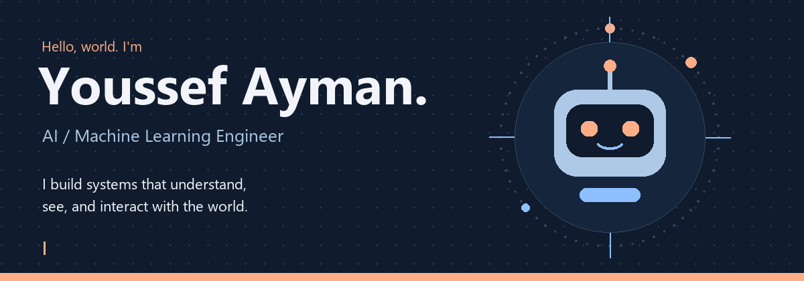
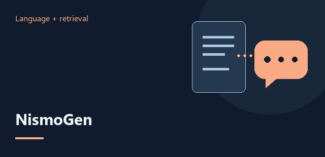
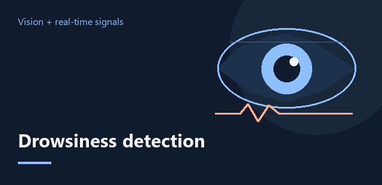
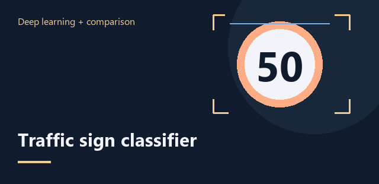
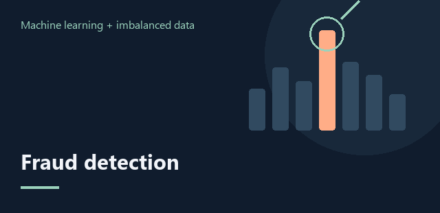

  <picture><source media="(prefers-reduced-motion: reduce)" srcset="assets/profile-hero.svg" /></picture>

  
  

<b>Based in Egypt · Open to AI / ML opportunities and collaborations</b>

 

## A little about me

I'm **Youssef Ayman Mohamed**, an AI / Machine Learning Engineer working across **generative AI, computer vision, and robotics**. I enjoy the engineering between a model and a useful application: retrieval, data preparation, interfaces, and connecting software to hardware.

Currently, I work as a **freelance AI engineer on Upwork**, evaluating AI-generated software and designing programming tasks that test reasoning, debugging, and code generation.

 

## Selected builds

<table>
<tr>
<td width="50%" valign="top">
<a href="https://github.com/youssefaymanmohamed/NismoGen-Chatbot"><picture><source media="(prefers-reduced-motion: reduce)" srcset="assets/nismogen.svg" /></picture></a>
<h3><a href="https://github.com/youssefaymanmohamed/NismoGen-Chatbot">NismoGen</a></h3>

<b>Turn documents into conversations.</b> A collaborative multimodal assistant for document Q&amp;A, summarization, image captioning, and speech input/output.

<code>LangChain</code> <code>Gemini</code> <code>FAISS</code> <code>Streamlit</code>

</td>
<td width="50%" valign="top">
<a href="https://github.com/youssefaymanmohamed/Drowness-Detection"><picture><source media="(prefers-reduced-motion: reduce)" srcset="assets/vision.svg" /></picture></a>
<h3><a href="https://github.com/youssefaymanmohamed/Drowness-Detection">Drowsiness detection</a></h3>

<b>From camera frames to eye-closure alerts.</b> A webcam application using facial landmarks, smoothed eye aspect ratios, and configurable visual and audio alerts.

<code>OpenCV</code> <code>MediaPipe</code> <code>NumPy</code>

</td>
</tr>
<tr>
<td width="50%" valign="top">
<a href="https://github.com/youssefaymanmohamed/TrafficSign_Classifier"><picture><source media="(prefers-reduced-motion: reduce)" srcset="assets/traffic.svg" /></picture></a>
<h3><a href="https://github.com/youssefaymanmohamed/TrafficSign_Classifier">Traffic sign classifier</a></h3>

<b>Custom CNN meets transfer learning.</b> Training and evaluation notebooks comparing a custom convolutional network with ResNet50 for traffic sign recognition.

<code>TensorFlow</code> <code>Keras</code> <code>ResNet50</code>

</td>
<td width="50%" valign="top">
<a href="https://github.com/youssefaymanmohamed/Fraud_Transaction_Detection"><picture><source media="(prefers-reduced-motion: reduce)" srcset="assets/fraud.svg" /></picture></a>
<h3><a href="https://github.com/youssefaymanmohamed/Fraud_Transaction_Detection">Fraud transaction detection</a></h3>

<b>Find patterns in imbalanced data.</b> A workflow covering exploration, robust scaling, SMOTE, and comparison of five supervised classifiers.

<code>Scikit-learn</code> <code>Pandas</code> <code>SMOTE</code>

</td>
</tr>
</table>

 

### Beyond the screen: B.E.M.O 🤖

A personal assistant robot that brings **language, vision, speech, and physical control** together. A Raspberry Pi 5 connects the AI software to cameras, microphones, sensors, motors, and a display.

**The engineering challenge:** coordinating perception and conversation with physical actions.

`Python` `LangChain` `Gemini` `FastAPI` `OpenCV` `ROS2 / Micro-ROS`

Public repository and demo are not available yet.

 

## My toolkit

<b>Languages</b>

<b>Generative AI &amp; NLP</b>

<b>Machine learning &amp; data</b>

<b>Web &amp; backend</b>

<b>Computer vision &amp; robotics</b>

<b>Development tools</b>

<b>Applied skills:</b> feature engineering, model evaluation, transfer learning, prompt engineering, document retrieval, and imbalanced classification.

 

---

<b>Have a problem that needs an AI engineer?</b> Let's talk about what you're building.

<a href="mailto:youssefaymanmohamed1@gmail.com">youssefaymanmohamed1@gmail.com</a> &nbsp; / &nbsp; <a href="https://www.linkedin.com/in/youssef-ayman-mohamed/">LinkedIn</a>

