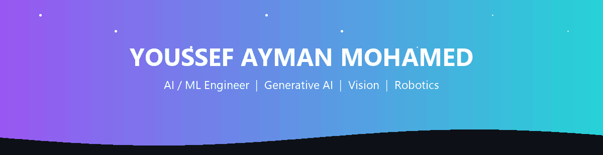
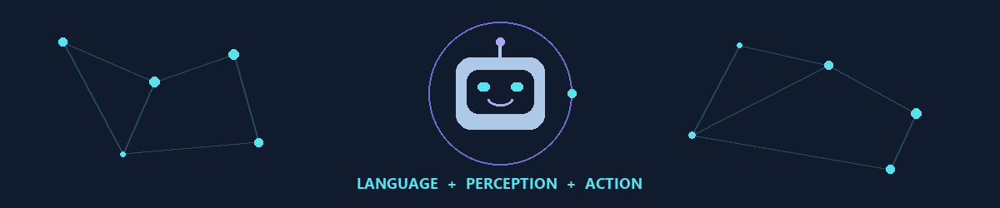

<div align="center">

<picture><source media="(prefers-reduced-motion: reduce)" srcset="assets/identity-wave.png" /></picture>


<a href="https://www.linkedin.com/in/youssef-ayman-mohamed/"></a>
<a href="mailto:youssefaymanmohamed1@gmail.com"></a>
<a href="https://github.com/youssefaymanmohamed?tab=repositories"></a>

<br /><br />
<picture><source media="(prefers-reduced-motion: reduce)" srcset="assets/neural-robot.png" /></picture>

</div>

## ⚡ About me

```yaml
name:      Youssef Ayman Mohamed
role:      AI / Machine Learning Engineer
location:  Egypt
focus:     [Generative AI, RAG, Computer Vision, Robotics]
education: B.Sc. Artificial Intelligence — AASTMT, 2025
currently: Freelance AI Engineer on Upwork
open_to:   AI / ML opportunities and collaborations
```

I enjoy the engineering between a model and a useful application: retrieval, data preparation, interfaces, and connecting software to hardware. My freelance work includes evaluating AI-generated software and designing tasks that test reasoning, debugging, and code generation.

---

## 🤖 Where software meets hardware

### B.E.M.O · Personal assistant robot

A robotic assistant bringing **language, vision, speech, and physical control** into one system. A Raspberry Pi 5 connects AI software with cameras, microphones, sensors, motors, and a display.

**The engineering challenge:** coordinating perception and conversation with physical actions.

`Python` `LangChain` `Gemini` `FastAPI` `OpenCV` `ROS2 / Micro-ROS`

<sub>Public code and demo are not available yet.</sub>

---

## 🛠️ Tech arsenal

<p align="center"><b>Languages</b></p>
<p align="center">


</p>
<br />

<p align="center"><b>Generative AI &amp; NLP</b></p>
<p align="center">


</p>
<br />

<p align="center"><b>Machine learning &amp; data</b></p>
<p align="center">


</p>
<br />

<p align="center"><b>Web &amp; backend</b></p>
<p align="center">


</p>
<br />

<p align="center"><b>Computer vision &amp; robotics</b></p>
<p align="center">


</p>
<br />

<p align="center"><b>Development tools</b></p>
<p align="center">


</p>
<br />

<p align="center"><b>Applied skills:</b> feature engineering, model evaluation, transfer learning, prompt engineering, document retrieval, and imbalanced classification.</p>

<br />

---

## 🚀 Highlighted projects

<table>
<tr>
<td width="50%" valign="top">
<a href="https://github.com/youssefaymanmohamed/NismoGen-Chatbot"><picture><source media="(prefers-reduced-motion: reduce)" srcset="assets/nismogen.svg" /></picture></a>
<h3><a href="https://github.com/youssefaymanmohamed/NismoGen-Chatbot">NismoGen</a></h3>
<p><b>Turn documents into conversations.</b><br />A collaborative multimodal assistant for document Q&amp;A, summarization, image captioning, and speech input/output.</p>
<p><code>LangChain</code> <code>Gemini</code> <code>FAISS</code> <code>Streamlit</code></p>
</td>
<td width="50%" valign="top">
<a href="https://github.com/youssefaymanmohamed/Drowness-Detection"><picture><source media="(prefers-reduced-motion: reduce)" srcset="assets/vision.svg" /></picture></a>
<h3><a href="https://github.com/youssefaymanmohamed/Drowness-Detection">Drowsiness detection</a></h3>
<p><b>From camera frames to eye-closure alerts.</b><br />A webcam application using facial landmarks, smoothed eye aspect ratios, and configurable visual and audio alerts.</p>
<p><code>OpenCV</code> <code>MediaPipe</code> <code>NumPy</code></p>
</td>
</tr>
<tr>
<td width="50%" valign="top">
<a href="https://github.com/youssefaymanmohamed/TrafficSign_Classifier"><picture><source media="(prefers-reduced-motion: reduce)" srcset="assets/traffic.svg" /></picture></a>
<h3><a href="https://github.com/youssefaymanmohamed/TrafficSign_Classifier">Traffic sign classifier</a></h3>
<p><b>Custom CNN meets transfer learning.</b><br />Training and evaluation notebooks comparing a custom convolutional network with ResNet50 for traffic sign recognition.</p>
<p><code>TensorFlow</code> <code>Keras</code> <code>ResNet50</code></p>
</td>
<td width="50%" valign="top">
<a href="https://github.com/youssefaymanmohamed/Fraud_Transaction_Detection"><picture><source media="(prefers-reduced-motion: reduce)" srcset="assets/fraud.svg" /></picture></a>
<h3><a href="https://github.com/youssefaymanmohamed/Fraud_Transaction_Detection">Fraud transaction detection</a></h3>
<p><b>Find patterns in imbalanced data.</b><br />A workflow covering exploration, robust scaling, SMOTE, and comparison of five supervised classifiers.</p>
<p><code>Scikit-learn</code> <code>Pandas</code> <code>SMOTE</code></p>
</td>
</tr>
</table>


<p align="center"><a href="https://github.com/youssefaymanmohamed?tab=repositories">View all projects</a></p>

---

## 📊 GitHub analytics

<div align="center">


<br /><br />


</div>

---

## 🌐 Let's connect

<p align="center">Open to AI / ML opportunities, collaborations, and interesting engineering problems.</p>
<p align="center">
<a href="https://www.linkedin.com/in/youssef-ayman-mohamed/"></a>
<a href="mailto:youssefaymanmohamed1@gmail.com"></a>
<a href="https://github.com/youssefaymanmohamed?tab=repositories"></a>
</p>
<p align="center"><b>Thanks for stopping by. Let's build something intelligent.</b></p>

<picture><source media="(prefers-reduced-motion: reduce)" srcset="assets/footer-wave.png" /></picture>
